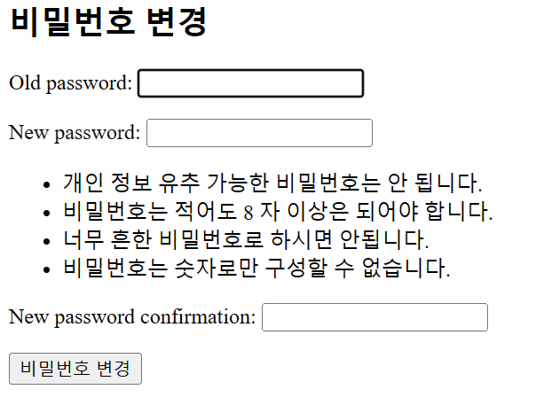
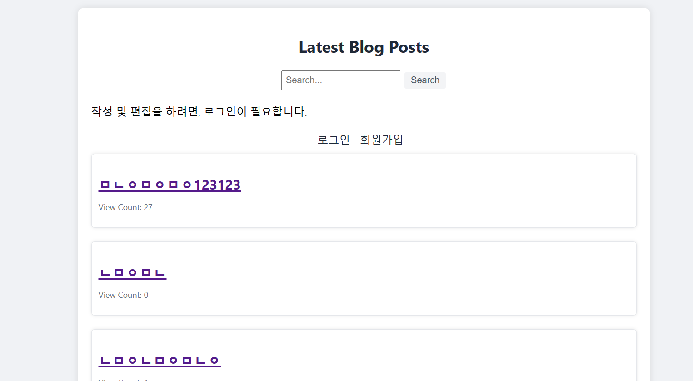
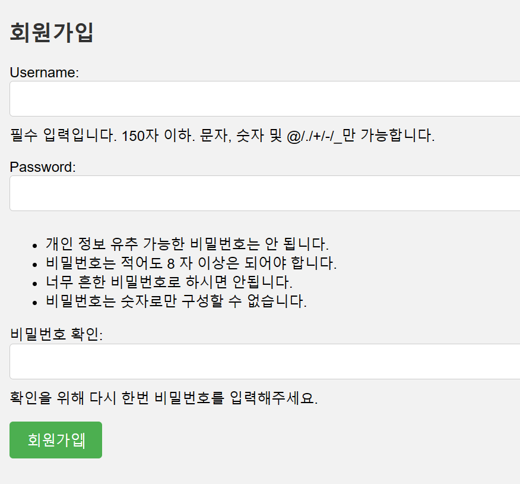
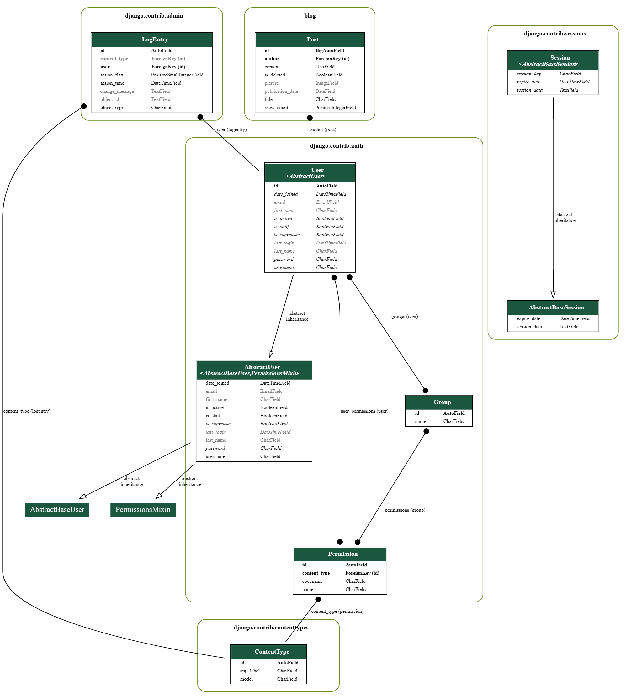

# 환영합니다!

# 1. 프로젝트 제목
'소설 리뷰 블로그'가 본 프로젝트의 주제 입니다.

# 2. 프로젝트 설명.
블로그 기능을 제공하는 웹 애플리케이션입니다.

## 2.1 주요 기능

- CRUD 기능: 블로그 게시물의 생성(Create), 조회(Read), 수정(Update), 삭제(Delete) 기능을 제공합니다.
- 회원가입 기능: 사용자는 회원으로 가입하여 블로그를 이용할 수 있습니다.
- 로그인 기능
- 회원 인증(Authorization) 기반 로직.
- 비밀번호 변경 기능: 회원은 자신의 비밀번호를 변경할 수 있습니다.
- 조회수 표시 기능
- 게시글 목록 표시, 상세조회 보기
## 2.2 기술 스택

프로젝트는 다음과 같은 기술을 사용하여 개발되었습니다.

- 프레임워크: Django (4.2.3)
- 데이터베이스: SQLite3
- 언어: Python, HTML/CSS
- 기타 라이브러리: [black formatter, graphviz, Pillow, django-extensions]
(자세한 것은 requirements.txt 를 참고해주세요.)
## 설치 및 실행

아래의 명령어를 사용하여 프로젝트를 설치하고 실행할 수 있습니다:

```windows powershell 기준
# 가상환경 설정 및 활성화
python -m venv backblog
source backblog/bin/activate

# 의존성 설치
pip install -r requirements.txt

# 데이터베이스 마이그레이션
python manage.py migrate

# 개발 서버 실행
project-backblog\app\python manage.py runserver

# 실행 주소
http://127.0.0.1:8000/
```
## 3. 한계점.
- 블로그에 앞서, 스레드 형식의 게시판과 유저라는 요소에만 중점을 두고 있습니다.
- 현재 언어는 한국어만 지원됩니다.
- UI 에 대한 사항은 배제하며 개발하였습니다.
- 테스트 케이스 코드 와 같은 TDD 요소를 아직 적용하지 않았습니다.
- DB 관련 스케일링(향후 서비스 시) 이슈에 대한 요소는 아직 고려되지 않았습니다.

# 구동 예시
## 1. 최초의 화면


## 2. 비밀번호 변경


## 3. 블로그 진입 시 화면.
home.html 의 template file 을 렌더링 한 후, blog_list.html 쪽에서 등록된 post 목록을 이곳에 표시합니다.


## 4. 비 로그인 상태


## 5. 회원가입


## 6. 작성


## 7. 사진 미디어, 그리고 로그인 작성자 일치 시 수정/삭제 권한.


## 8. 비 로그인 및 유저 인증이 일치하지 않는 경우, 수정 삭제 숨김.


## 상세 설명.
```
URL 구성 (urls.py)
---------------------------

블로그 앱의 URL 구성은 `urls.py` 파일에 정의되어 있습니다. URL 및 해당하는 뷰는 다음과 같습니다:

- 루트 URL / 및 /blog/은 각각 HomeView 및 WelcomeView에 매핑됩니다.
- /list/ URL은 BlogListView를 통해 blog_list.html 템플릿을 렌더링합니다.
- /blog/<int:pk>/ URL은 BlogDetailView를 사용하여 블로그 게시물의 상세 보기를 표시합니다.
- /blog/write/ URL은 PostCreateView를 사용하여 새로운 블로그 게시물을 생성합니다.
- /blog/edit/<int:pk>/ URL은 PostEditView를 사용하여 기존의 블로그 게시물을 수정합니다.
- /blog/delete/<int:pk>/ URL은 PostDeleteView를 사용하여 블로그 게시물을 삭제합니다.
- /blog/search/ URL은 PostSearchView를 사용하여 블로그 게시물을 검색합니다.
- /login/ URL은 LoginView를 사용하여 사용자 로그인을 처리합니다.
- /logout/ URL은 사용자 로그아웃을 처리합니다.
- /signup/ URL은 `SignupView`를 사용하여 사용자 회원가입을 처리합니다.
- /blog/deleted/ URL은 삭제된 게시물에 대한 사용자 지정 메시지를 표시합니다.
- /change_password/ URL은 `ChangePasswordView`를 사용하여 사용자의 비밀번호를 변경합니다.

모델

 (models.py)
--------------------

Post 모델은 블로그 게시물을 나타내며 다음과 같은 필드를 포함합니다:

- title: 게시물 제목
- content: 게시물 내용
- is_deleted: 게시물 삭제 여부
- author: 게시물 작성자(User 모델과의 외래 키 관계)
- publication_date: 게시물 작성 날짜
- picture: 게시물 이미지
- view_count: 게시물 조회수

뷰 (views.py)
----------------

- WelcomeView: welcome.html 템플릿을 렌더링하여 사용자에게 초기 화면을 보여줍니다.
- HomeView: home.html 템플릿을 렌더링하여 최신 블로그 게시물을 보여줍니다.
- BlogListView: blog_list.html 템플릿을 렌더링하여 모든 블로그 게시물을 보여줍니다.
- BlogDetailView: blog_detail.html 템플릿을 렌더링하여 특정 블로그 게시물의 세부 정보를 보여줍니다.
- PostEditView: post_edit.html 템플릿을 렌더링하여 블로그 게시물을 수정합니다.
- PostDeleteView: post_delete.html 템플릿을 렌더링하여 블로그 게시물을 삭제합니다.
- PostSearchView: post_search.html 템플릿을 렌더링하여 블로그 게시물을 검색합니다.
- SignupView: signup.html 템플릿을 렌더링하여 사용자 회원가입을 처리합니다.
- LoginView: login.html 템플릿을 렌더링하여 사용자 로그인을 처리합니다.
- LogoutView:사용자 로그아웃을처리합니다.
- PostCreateView: post_write.html 템플릿을 렌더링하여 새로운 블로그 게시물을 생성합니다.
- DeletedPostView: 삭제된 게시물에 대한 사용자 정의 메시지를 표시합니다.
- ChangePasswordView: change_password.html 템플릿을 렌더링하여 사용자의 비밀번호를 변경합니다.

폼 (forms.py)
-----------------

PostForm 폼 클래스는 `forms.py` 파일에 정의되어 있습니다. 이 폼은 `PostCreateView`와 PostEditView에서 블로그 게시물의 생성 및 수정에 사용됩니다.
```

## 그 외. (ERDs)
