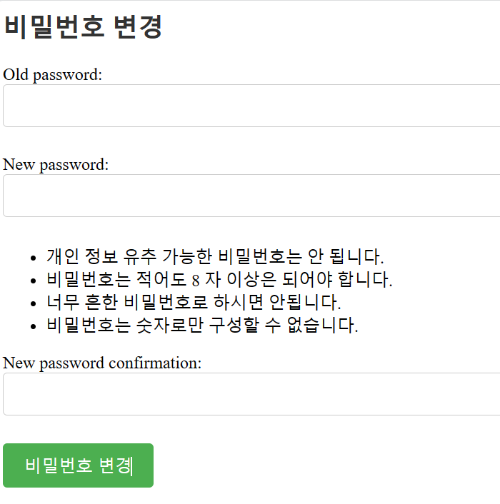
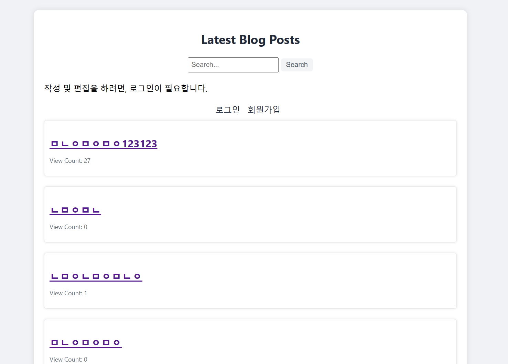
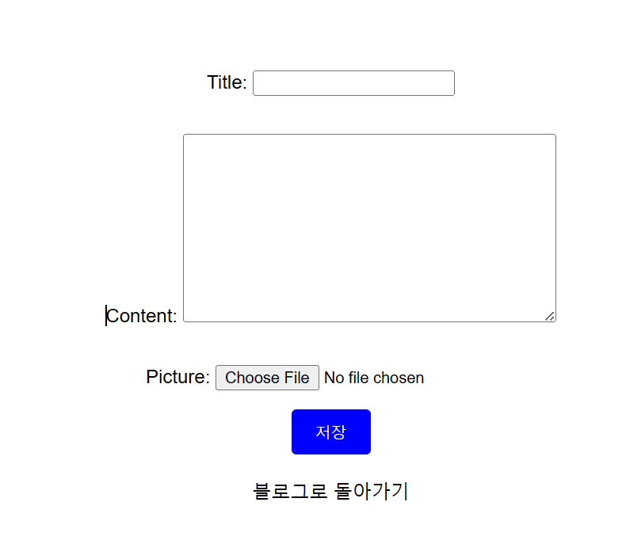
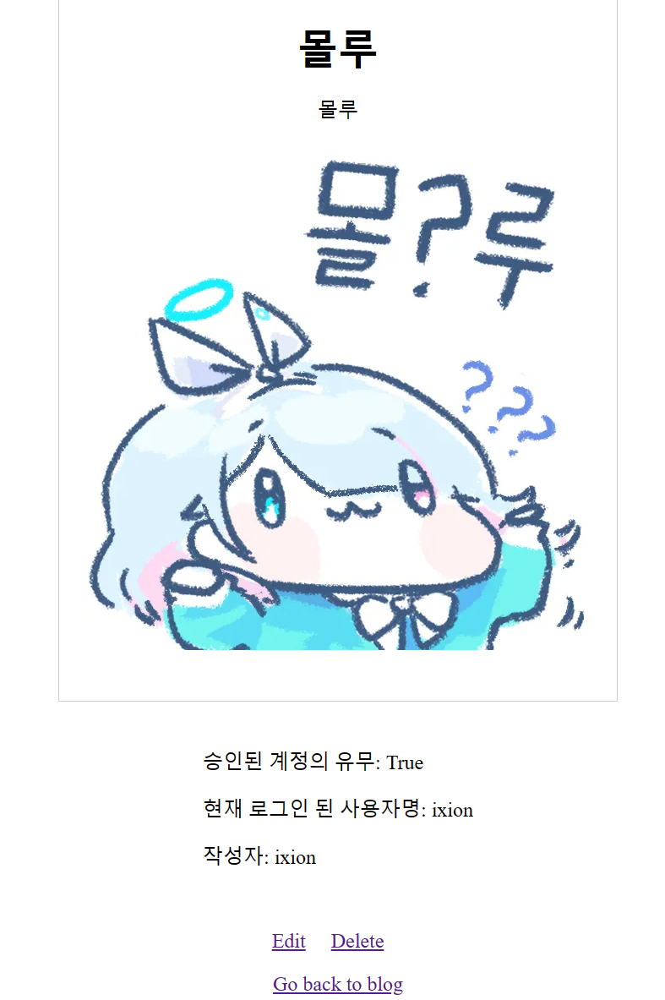

# 환영합니다!

# 1. 프로젝트 제목
'소설 리뷰 블로그'가 본 프로젝트의 주제 입니다.

# 2. 프로젝트 설명.
블로그 기능을 제공하는 웹 애플리케이션입니다.

## 2.1 주요 기능

- CRUD 기능: 블로그 게시물의 생성(Create), 조회(Read), 수정(Update), 삭제(Delete) 기능을 제공합니다.
- 회원가입 기능: 사용자는 회원으로 가입하여 블로그를 이용할 수 있습니다.
- 로그인 기능
- 회원 인증(Authorization) 기반 로직.
- 비밀번호 변경 기능: 회원은 자신의 비밀번호를 변경할 수 있습니다.
- 조회수 표시 기능
- 게시글 목록 표시, 상세조회 보기
## 2.2 기술 스택

프로젝트는 다음과 같은 기술을 사용하여 개발되었습니다.

- 프레임워크: Django (4.2.3)
- 데이터베이스: SQLite3
- 언어: Python(3.10.6) 
- 마크업, 스타일시트 언어: HTML/CSS
- 기타 라이브러리: [flake8, graphviz, Pillow, django-extensions]
(자세한 것은 requirements.txt 를 참고해주세요.)
## 설치 및 실행

아래의 명령어를 사용하여 프로젝트를 설치하고 실행할 수 있습니다.

```windows powershell 기준
# 가상환경 설정 및 활성화
python -m venv backblog
.\backblog\Scripts\activate

# 의존성 설치
pip install -r requirements.txt

# 데이터베이스 마이그레이션
python manage.py migrate

# 개발 서버 실행
python manage.py runserver

# 실행 주소
http://127.0.0.1:8000/
or
docker-compose up
then access to localhost:80 

This is due to the setup made of nginx and docker. Will be updated in Korean shortly.

New ()
```
## 3. 한계점
- 블로그에 앞서, 스레드 형식의 게시판과 유저라는 요소에만 중점을 두고 있습니다.
- UI 에 대한 사항은 배제하며 개발하였습니다.
- 테스트 코드와 같은 TDD(Test Driven Development) 요소는 현재 적용되지 않았습니다.
- DB 관련 스케일링(향후 서비스 시) 이슈에 대한 요소는 아직 고려되지 않았습니다.
- 현재 언어는 한국어만 지원됩니다.

# 구동 예시
## 1. 최초의 화면


## 2. 비밀번호 변경


## 3. 블로그 진입 시 화면 (비 로그인 상태)
home.html 의 template file 을 렌더링 한 후, blog_list.html 쪽에서 등록된 post 목록을 이곳에 표시합니다.


## 4. 회원가입 


## 5. 작성 


## 6. 사진 미디어, 그리고 로그인 작성자 일치 시 수정/삭제 권한.


## 7. 비 로그인 및 유저 인증이 일치하지 않는 경우, 수정 삭제 숨김.


## 상세 설명.
```
URL 구성 (urls.py):
- 루트 URL /와 /blog/은 각각 HomeView와 WelcomeView에 매핑됩니다.
- /list/ URL은 BlogListView로, /blog/<int:pk>/ URL은 BlogDetailView로 매핑됩니다.
- /blog/write/ URL은 PostCreateView로, /blog/edit/<int:pk>/ URL은 PostEditView로 매핑됩니다.
- /blog/delete/<int:pk>/ URL은 PostDeleteView로, /blog/search/ URL은 PostSearchView로 매핑됩니다.
- /login/ URL은 LoginView로, /logout/ URL은 LogoutView로 매핑됩니다.
- /signup/ URL은 SignupView로, /blog/deleted/ URL은 DeletedPostView로 매핑됩니다.
- /change_password/ URL은 ChangePasswordView로 매핑됩니다.
```

## DBML 이미지


## 기타 참고 링크
-https://www.django-rest-framework.org/

## Command line (development only)
docker-compose run --rm app sh -c "name of its object"

## Improvement
(planned in security field)
